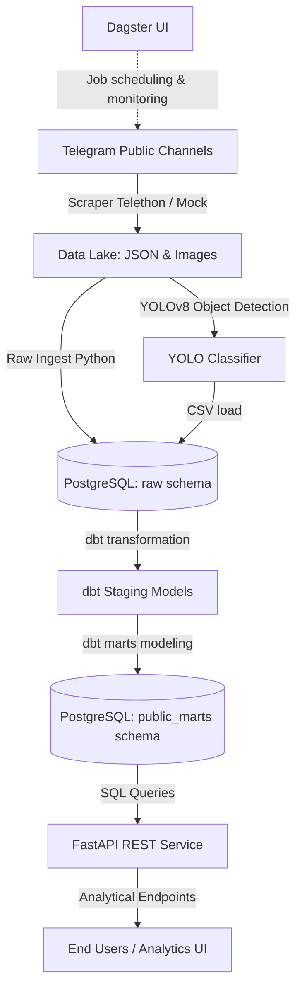

# Ethiopian Medical Business Data Warehouse & Analytics Platform

An end-to-end modern ELT (Extract, Load, Transform) data pipeline designed to ingest, model, enrich, and analyze data scraped from Ethiopian medical Telegram channels.

## Architecture Diagram


## Features
- **Scraper Pipeline (`src/scraper.py`)**: Uses Telethon to extract message IDs, text, dates, views, forwards, and media. Automatically falls back to mock data if credentials are not configured in `.env`.
- **Database Loader (`src/load_raw.py`)**: Populates the raw data tables in PostgreSQL.
- **dbt Transformation (`medical_warehouse/`)**:
  - Implements clean, casted staging models.
  - Implements dimensional star schema marts (`dim_channels`, `dim_dates`, `fct_messages`, `fct_image_detections`).
  - Contains rigorous validation tests (schema tests & custom tests like future dates check).
- **YOLOv8 Image Enrichment (`src/yolo_detect.py`)**: Performs classification into `promotional`, `product_display`, `lifestyle`, or `other` using YOLO object detections (e.g. `person`, `bottle`).
- **FastAPI Backend (`api/`)**: Exposes analytical REST endpoints for business insights:
  - `GET /api/reports/top-products`
  - `GET /api/channels/{channel_name}/activity`
  - `GET /api/search/messages`
  - `GET /api/reports/visual-content`
- **Dagster Orchestrator (`pipeline.py`)**: Handles dependency management, scheduling, logging, and job state.

## Getting Started

### 1. Environment Setup
Create a `.env` file in the root:
```env
DB_HOST=localhost
DB_PORT=5432
DB_NAME=medical_db
DB_USER=postgres
DB_PASSWORD=postgres

# Optional: Add for live Telegram scraping
TELEGRAM_API_ID=
TELEGRAM_API_HASH=
```

### 2. Run Database
```bash
docker compose up -d
```

### 3. Installation
```bash
pip install -r requirements.txt
```

### 4. Run Dagster Orchestrator
```bash
dagster dev -f pipeline.py
```
Open http://localhost:3000 to launch the UI and run the pipeline.

### 5. Running the API
```bash
uvicorn api.main:app --reload
```
View the interactive docs at http://localhost:8000/docs.
