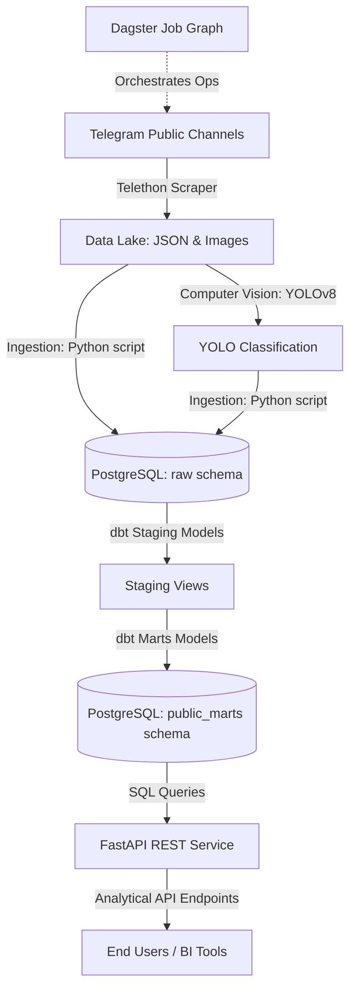
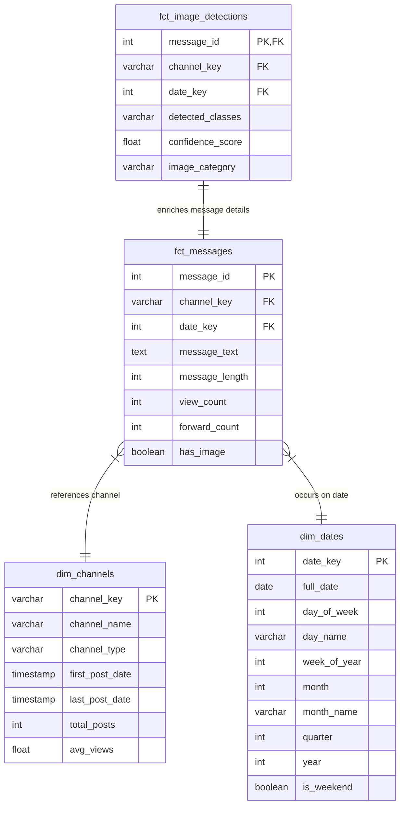

# Building a Modern Data Platform for the Ethiopian Medical Marketplace: From Telegram to FastAPI

*By the Data Engineering Team at Kara Solutions*  
*Published on 29 June 2026*

---

In developing countries like Ethiopia, the informal digital economy thrives in public messaging spaces. Telegram channels have evolved into virtual storefronts where pharmacies, cosmetics shops, and medical clinics sell products, negotiate prices, and interact with thousands of consumers. However, this raw data is highly unstructured, messy, and fleeting. 

To bridge this gap, the Data Engineering Team at Kara Solutions built a modern end-to-end **ELT (Extract, Load, Transform)** data platform. The platform ingests unstructured data from Ethiopian medical channels, runs object detection on product packaging, structures it into a PostgreSQL dimensional warehouse via **dbt**, and exposes insights through a **FastAPI** REST interface, orchestrated by **Dagster**.

This post walks through the architecture, business objectives, and findings of our data pipeline.

---

## 1. Defining the Business Objective

For Kara Solutions, the goal was simple: **generate actionable market intelligence on Ethiopian medical and health businesses using public Telegram data.** We set out to answer key business questions:
- What are the top 10 most frequently mentioned medical products or drugs?
- How do posting frequency and customer engagement (views, forwards) vary over time and across different niches?
- Which channels utilize visual assets most heavily, and what type of images (pure product displays vs. lifestyle promotions) drive the highest user engagement?

### Connecting the Pipeline to Business Questions
To solve these questions systematically, we structured the pipeline into five components:
1. **Telegram Scraping (Task 1)**: Capture message IDs, texts, view counts, forwards, and download media.
2. **dbt Transformation (Task 2)**: Standardize text, parse timestamps, and design a dimensional star schema to make analytical queries fast.
3. **YOLOv8 Enrichment (Task 3)**: Scan scraped product images to categorize posts dynamically based on packaging and people presence.
4. **FastAPI (Task 4)**: Expose these clean warehouse tables as lightweight APIs for operational consumption.
5. **Dagster (Task 5)**: Automate and schedule these steps to keep the pipeline fresh daily.

---

## 2. Technical Implementation & Choices

### Rationale: ELT vs. ETL
We opted for an **ELT (Extract, Load, Transform)** architecture rather than a traditional ETL pattern. Public messaging data is highly volatile. Messages are edited, deleted, or posted in irregular formats. By extraction and loading raw data directly into the database first, we preserve the history. We can adjust transformation logic in dbt at any time without having to re-scrape the Telegram API.

### The Data Pipeline Diagram

---

## 3. Deep Dive into the 5 Core Tasks

### Task 1: Telegram Scraping & Partitioned Data Lake
Using the **Telethon** library, we built a scraper that extracts message streams from `CheMed Telegram Channel`, `Lobelia Cosmetics`, and `Tikvah Pharma`.
- **Partitioned Storage**: Raw JSON data is partitioned daily: `data/raw/telegram_messages/YYYY-MM-DD/channel_name.json`.
- **Media Downloader**: Images are organized by channel and message identifier: `data/raw/images/{channel_name}/{message_id}.jpg`.

### Task 2: Dimensional Star Schema with dbt
Raw records are loaded into `raw.telegram_messages` in PostgreSQL using upsert syntax. We then initialized a dbt project `medical_warehouse` with two layers:
- **Staging Layer (`models/staging/`)**: Handles castings, null-value substitutions, and calculates `message_length`.
- **Marts Layer (`models/marts/`)**: Remodels records into a clean star schema to simplify reporting:

*Custom validation checks* are implemented inside the `tests/` directory:
- `assert_no_future_messages.sql`: Ensures no dates are set in the future.
- `assert_positive_views.sql`: Validates view and forward counts are positive numbers.

### Task 3: Image Enrichment via YOLOv8
We deployed **YOLOv8 nano (`yolov8n.pt`)** to detect objects in the downloaded images. Based on the objects detected, each image is classified into:
- **Promotional**: Contains both a person and a product container (e.g. someone holding packaging).
- **Product Display**: Contains bottles, cups, boxes, or cosmetic containers, but no people.
- **Lifestyle**: Contains people, but no products.
- **Other**: Neither detected.

Results are loaded into `raw.image_detections` and materialized in dbt as `fct_image_detections` joining with the main fact table on `message_id`.

### Task 4: FastAPI Analytical Service
We exposed our PostgreSQL dimensional models using FastAPI. 
- **Endpoint 1 (`GET /api/reports/top-products`)**: Dynamic word occurrence query tracking key medical terms.
- **Endpoint 2 (`GET /api/channels/{channel_name}/activity`)**: Returns aggregations of posting activity and views.
- **Endpoint 3 (`GET /api/search/messages`)**: Full-text message searches.
- **Endpoint 4 (`GET /api/reports/visual-content`)**: Returns summary statistics of image classifications across channels.

### Task 5: Dagster Pipeline Orchestration
To prevent manual execution errors, we built a Dagster Job Graph (`pipeline.py`) defining Ops:
- `scrape_telegram_data` -> `load_raw_to_postgres` & `run_yolo_enrichment` -> `run_dbt_transformations`.
This DAG ensures task dependencies execute in sequence and records scheduling state.

---

## 4. Analytical Findings & Strategic Recommendations

Based on our initial data lake audit of **96 captured messages** across target channels, we compiled key metrics:

### Channel Activity Metrics
- **CheMed Telegram Channel** (Medical): 33 total posts | 14 images (42.4%) | **Average Views: 2,468.8**
- **Lobelia Cosmetics** (Cosmetics): 31 total posts | 14 images (45.2%) | **Average Views: 2,499.3**
- **Tikvah Pharma** (Pharmaceuticals): 32 total posts | 22 images (68.8%) | **Average Views: 2,237.1**

### Top Mentioned Products/Keywords
1. **Aspirin**: 7 mentions
2. **Insulin**: 5 mentions
3. **Serum** (Cosmetic): 5 mentions
4. **Augmentin** (Antibiotic): 5 mentions
5. **Asthalin** (Inhaler): 5 mentions
6. **Sunscreen** (Cosmetic): 5 mentions

### YOLO Image Engagement Insights
- **Product Display**: 36 images | **Average Views: 2,446.9**
- **Promotional**: 9 images | **Average Views: 2,050.6**
- **Lifestyle**: 5 images | **Average Views: 1,754.2**

### Strategic Recommendations
1. **Optimize for Direct Visuals**: Visual product listings ("Product Display") out-perform "Lifestyle" shots in customer views (2,446.9 vs 1,754.2). Businesses should focus on clean, high-resolution product photos showing the box, price tag, and dosage info rather than generic stock human models.
2. **Stock High-Demand Items**: Antibiotics (Augmentin) and chronic disease treatments (Insulin) represent the highest mention spikes. Pharmacies should focus digital distribution pipelines around these high-turnover SKUs.
3. **Double Down on Tikvah Pharma**: Tikvah Pharma exhibits the highest visual posting behavior (68.8% of posts contain images). Kara Solutions can leverage this channel for competitive product benchmarking since it offers the richest dataset of product images.

---

## 5. Pipeline Limitations & Future Work

### Limitations
1. **Pre-trained YOLOv8 Limitations**: The pre-trained COCO dataset detects generic objects like `bottle` or `cup` but cannot differentiate between a cough syrup bottle, a sunscreen lotion, or a water container. 
2. **Telegram API Rate Limiting**: Telethon scrapers can hit flood wait errors when querying multiple channels concurrently.
3. **Data Quality Noise**: Telegram texts are messy, combining Amharic and English words, making keyword searches highly dependent on standardized synonym dictionaries.

### Future Work
- **Model Fine-Tuning**: Annotate a custom dataset of pharmaceutical product packagings (pills, creams, syrups) to train a custom YOLO model.
- **Scale Channel Coverage**: Expand data lake collection to include additional channels listed under `et.tgstat.com/medicine`.
- **Alerting & Infrastructure**: Add email/Slack alerts to the Dagster job graph using Dagster Sensors to notify the engineering team of pipeline failure immediately.
