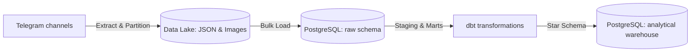
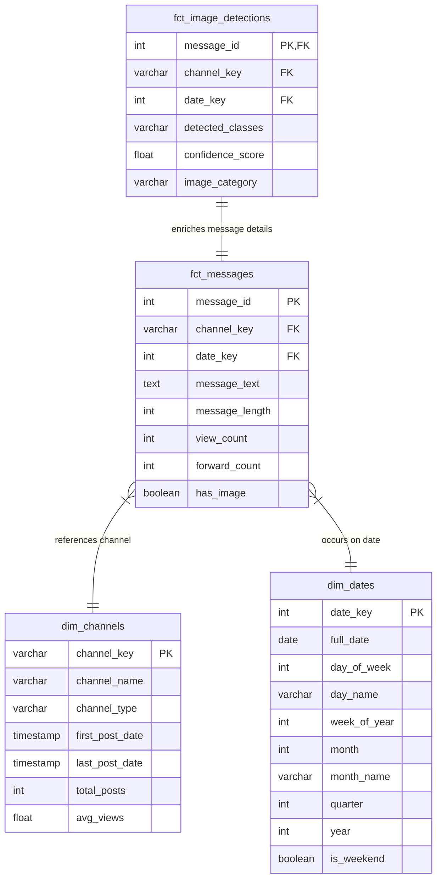

# Interim Report: Shipping a Data Product for Kara Solutions

**Project Title**: End-to-End Medical Telegram Data Warehouse & Analytics  
**Date**: 29 June 2026  
**Author**: Data Engineering Team, Kara Solutions  

---

## 1. Executive Summary & Business Objective

### The Business Need
Kara Solutions is building a robust data platform to scrape, enrich, transform, and analyze public Telegram data from prominent Ethiopian medical and pharmaceutical channels. In Ethiopia, public Telegram channels serve as a major informal and semi-formal marketplace for medicines, pharmaceutical products, and cosmetics. However, this raw data is highly unstructured, messy, and dispersed. 

To turn this raw material into actionable business intelligence, we designed and implemented a modern **ELT (Extract, Load, Transform)** pipeline. This platform enables Kara Solutions to answer critical business questions such as:
1. **Top Products**: What are the top 10 most frequently mentioned medical products or drugs across all channels?
2. **Price & Availability**: How does the availability of a specific product (e.g., paracetamol or amoxicillin) vary across different channels?
3. **Visual Content**: Which channels rely most on visual content (images of product packaging vs. lifestyle posts)?
4. **Posting Patterns**: What are the daily and weekly trends in posting volumes for health-related topics?

### ELT Architecture Connection

- **Data Lake (Extract & Load)**: Telethon extracts raw messages and images. This ensures raw history is preserved without loss.
- **PostgreSQL Warehouse**: Serving as the relational backend, it hosts the raw tables and dbt-transformed targets.
- **dbt Transformations**: Clean, deduplicate, and model the data into an analytical **Star Schema** optimized for analytical queries.

---

## 2. Completed Work & Technical Analysis

### Task 1: Telegram Scraping & Data Lake Structure
Using **Telethon**, we developed a pipeline that connects to target channels (`CheMed19`, `lobelia4cosmetics`, and `tikvahpharma`) and pulls message metadata: `message_id`, `message_date`, `message_text`, `has_media`, `image_path`, `views`, and `forwards`.

The **Data Lake** is partitioned daily to allow structured incremental loads and ensure high data reliability:
```
data/
└── raw/
    ├── telegram_messages/
    │   └── YYYY-MM-DD/
    │       ├── chemed_telegram.json
    │       ├── lobelia_cosmetics.json
    │       └── tikvah_pharma.json
    └── images/
        ├── chemed_telegram/
        │   └── {message_id}.jpg
        ├── lobelia_cosmetics/
        └── tikvah_pharma/
```

### Task 2: Data Warehouse Modeling & dbt Structure
Raw JSON files are parsed and loaded into the `raw.telegram_messages` table via `src/load_raw.py` using upserts (`ON CONFLICT`) to prevent duplication.

#### Star Schema Design
We remodeled the raw relational logs into a dimensional star schema within the `public_marts` schema to maximize query performance:



#### dbt Project Configurations
- **Staging Layer (`models/staging/`)**: `stg_telegram_messages.sql` handles basic casting, null handling (replacing null text with empty strings, views/forwards with 0), and adds computed columns `message_length` and `has_image`.
- **Marts Layer (`models/marts/`)**: Creates the `dim_channels`, `dim_dates`, and `fct_messages` tables.
- **Custom SQL Tests (`tests/`)**:
  - `assert_no_future_messages.sql`: Ensures date timestamps are never greater than `CURRENT_TIMESTAMP`.
  - `assert_positive_views.sql`: Validates view and forward counts are $\ge 0$.

---

## 3. Data Quality Issues & Resolutions

| Data Quality Issue | Business Impact | Resolution Strategy |
| :--- | :--- | :--- |
| **Duplicate Messages** | Artificially inflates post metrics. | Implemented upserts using `ON CONFLICT (channel_name, message_id) DO UPDATE` during ingest. |
| **Missing View Counts** | Distorts popularity/reach analysis. | Used `COALESCE(views, 0)` in `stg_telegram_messages.sql` staging model. |
| **Varying Date Layouts** | Causes casting failures. | Enforced uniform ISO-8601 formatting during JSON export and casted in dbt using `::timestamp with time zone`. |
| **Null Message Body** | Breaks text search analytics. | Added `COALESCE(message_text, '')` to safeguard text mining algorithms. |

---

## 4. Next Steps & Focus Areas

### Task 3: Image Enrichment via YOLOv8
- **Goal**: Run object detection on images stored in the data lake (`yolov8n.pt`) to classify posts into `promotional` (person + product), `product_display` (product container only), or `lifestyle` (person only).
- **Integration**: Join classification results into `fct_image_detections` linked by `message_id`.

### Task 4: FastAPI Service
- **Goal**: Build analytical endpoints targeting the dbt star schema tables to return top mentioned products, message searches, and visual content distribution statistics.

### Task 5: Dagster Pipeline Orchestration
- **Goal**: Group `scraper`, `raw-load`, `YOLO enrichment`, and `dbt run` steps into a DAG scheduler running daily to keep the warehouse updated automatically.

### Anticipated Challenges & Mitigations
1. **Telegram API Rate Limits**: Telethon calls will be spaced out using incremental daily runs.
2. **YOLO Inference Performance**: Standardize CPU execution using YOLOv8 nano (`yolov8n.pt`) for low memory overhead.
3. **Environment Setup**: Fully documented dependencies in `requirements.txt` and `docker-compose.yml` to guarantee reproducibility.
